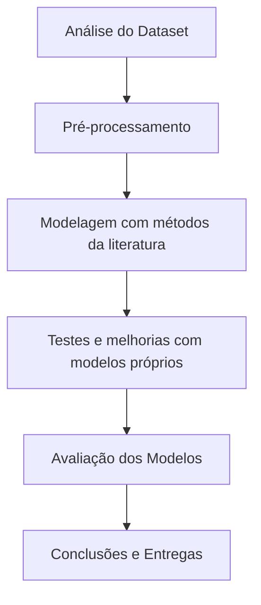

<p align="center">
  
  
  
  
  
  
  
</p>

<h1 align="center">♻️ Classificação de Resíduos Recicláveis</h1>

---

## 📑 Índice

- [📑 Índice](#-índice)
- [📝 Descrição](#-descrição)
- [🎯 Objetivos](#-objetivos)
- [🧰 Funcionalidades](#-funcionalidades)
- [🧠 Casos de Uso](#-casos-de-uso)
- [🔄 Pipeline do Projeto](#-pipeline-do-projeto)
- [📊 Dataset](#-dataset)
- [🚩 warp-waste-classification ⚠️](#-warp-waste-classification-️)
- [📥 Clonar Repositório](#-clonar-repositório)
- [🤝 Contribuições](#-contribuições)
- [🚀 Melhorias Futuras](#-melhorias-futuras)
- [🛠️ Tecnologias, Bibliotecas e Dependências](#️-tecnologias-bibliotecas-e-dependências)
- [👥 Squad](#-squad)
- [📜 Licença](#-licença)

---

## 📝 Descrição

Este projeto tem como objetivo desenvolver um modelo de **Machine Learning e Visão Computacional** capaz de classificar imagens de resíduos recicláveis nas categorias **papel, vidro, metal, plástico**, entre outros.

Desenvolvido no contexto do **Bootcamp em Machine Learning**, o projeto aplica técnicas de aprendizado de máquina e análise de dados para uma solução sustentável.

---

## 🎯 Objetivos

Desenvolver um modelo capaz de **classificar corretamente resíduos recicláveis a partir de imagens**, contribuindo para soluções sustentáveis e inteligentes.

- ✔️ Analisar e preparar o dataset.
- ✔️ Aplicar modelos da literatura.
- ✔️ Propor melhorias e desenvolver modelos próprios.
- ✔️ Avaliar o desempenho dos modelos.
- ✔️ Documentar metodologia, resultados e aprendizados.

---

## 🧰 Funcionalidades

- 📦 Classificação automática de imagens de resíduos recicláveis.
- 🔍 Análise exploratória dos dados (EDA).
- 🧠 Desenvolvimento de modelos com machine learning e deep learning.
- 📊 Avaliação com métricas robustas.
- 🚀 Pipeline completo de dados, modelagem e resultados.

---

## 🧠 Casos de Uso

- ♻️ Otimização de processos de triagem em centros de reciclagem.
- 🏭 Aplicação industrial para automação de separação de resíduos.
- 🧑‍🏫 Base para pesquisas acadêmicas e experimentos em visão computacional.

---

## 🔄 Pipeline do Projeto



---

## 📊 Dataset

- 📦 **Nome:** Warp Waste Recycling Plant Dataset
- 🔗 **Link:** [Acessar no Kaggle](https://www.kaggle.com/datasets/parohod/warp-waste-recycling-plant-dataset)

**Descrição:**  
O dataset contém imagens categorizadas de resíduos recicláveis, incluindo papel, metal, vidro e plástico. Utilizado para treino, validação e teste dos modelos.

---

## 🚩 warp-waste-classification ⚠️

Repositório contendo:  
- Notebooks com análises, modelagem e experimentos.  
- Scripts Python para automação e tratamento de dados.  
- Resultados, gráficos e modelos exportados.  

🔗 [Acessar repositório warp-waste-classification](https://github.com/seu-usuario/warp-waste-classification)

---

## 📥 Clonar Repositório

```bash
git clone https://github.com/seu-usuario/nome-do-repositorio.git
```

---

## 🤝 Contribuições

1. Faça um fork 🚀  
2. Crie sua branch (`git checkout -b feature/minha-feature`)  
3. Commit suas alterações (`git commit -m 'feat: minha feature'`)  
4. Push na branch (`git push origin feature/minha-feature`)  
5. Abra um Pull Request 🎉  

---

## 🚀 Melhorias Futuras

- 🔥 Deploy como API (Flask ou FastAPI).  
- 🌐 Desenvolvimento de uma interface web.  
- 📱 Aplicativo mobile para classificação em tempo real.  
- ⚙️ Testar modelos mais avançados (EfficientNet, YOLO, MobileNet).  
- 🧠 Aplicação de aprendizado contínuo e autoML.  

---

## 🛠️ Tecnologias, Bibliotecas e Dependências

- **Linguagem:** Python 3.10+
- **Bibliotecas:**
  - Pandas
  - NumPy
  - Scikit-Learn
  - TensorFlow ou PyTorch
  - OpenCV
  - Matplotlib
  - Seaborn
  - Jupyter Notebook
- **Ferramentas:**
  - Kaggle
  - Google Colab ou JupyterLab
  - Git e GitHub

---

## 👥 Squad

<table align="center">
  <tr>
    <td align="center">
      <a href="https://www.linkedin.com/in/ana-sofia-moura-27b003248/">
        <br>
      </a>
      <sub>
          <b>Ana Sofia Moura</b>
         </sub>
    <br>
        <a href="https://github.com/Sun-cs-Sol">
            
        </a>
        <br>
        <a href="https://www.linkedin.com/in/ana-sofia-moura-27b003248/">
            
        </a>
    </td>
    <td align="center">
      <a href="https://github.com/Elineison">
        <br>
      </a>
      <sub>
          <b>Elineison de Sousa</b>
         </sub>
    <br>
        <a href="https://github.com/Elineison">
            
        </a>
        <br>
        <a href="https://www.linkedin.com/in/elineison-inacio-de-sousa/">
            
        </a>
    </td>
    <td align="center">
      <a href="https://www.linkedin.com/in/francis-lauriano-9b674a27b/">
        <br>
      </a>
      <sub>
          <b>Francis Lauriano</b>
         </sub>
    <br>
        <a href="https://github.com/FrancisLauriano">
            
        </a>
        <br>
        <a href="https://www.linkedin.com/in/francis-lauriano-9b674a27b/">
            
        </a>
    </td>
    <td align="center">
      <a href="https://www.linkedin.com/in/usuario-4">
        <br>
      </a>
      <sub>
          <b>Iza Vieira</b>
         </sub>
    <br>
        <a href="https://github.com/usuario-4">
            
        </a>
        <br>
        <a href="https://www.linkedin.com/in/usuario-4">
            
        </a>
    </td>
    <td align="center">
      <a href="https://www.linkedin.com/in/madelu-lopes-089388120/">
        <br>
      </a>
      <sub>
          <b>Madelu Lopes</b>
         </sub>
    <br>
        <a href="https://github.com/Mads8760">
            
        </a>
        <br>
        <a href="https://www.linkedin.com/in/madelu-lopes-089388120/">
            
        </a>
    </td>
        <td align="center">
      <a href="https://www.linkedin.com/in/usuario-6">
        <br>
      </a>
      <sub>
          <b>Mariana Angeli</b>
         </sub>
    <br>
        <a href="https://github.com/usuario-6">
            
        </a>
        <br>
        <a href="https://www.linkedin.com/in/usuario-6">
            
        </a>
    </td>
    <td align="center">
      <a href="https://www.linkedin.com/in/usuario-7">
        <br>
      </a>
      <sub>
          <b>Rodrigo Rocha</b>
         </sub>
    <br>
        <a href="https://github.com/usuario-7">
            
        </a>
        <br>
        <a href="https://www.linkedin.com/in/usuario-7">
            
        </a>
    </td>
    
  </tr>
</table>

---

## 📜 Licença

Este projeto está sob a licença **MIT** — Consulte o arquivo [LICENSE](LICENSE) para mais informações.  

Projeto desenvolvido exclusivamente para fins educacionais no contexto do **Bootcamp em Machine Learning**.

---
